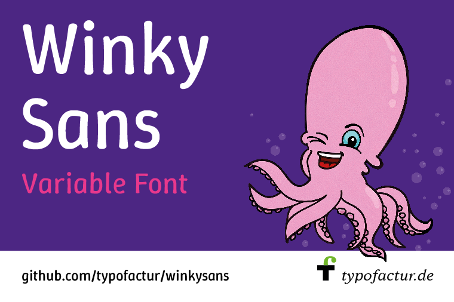
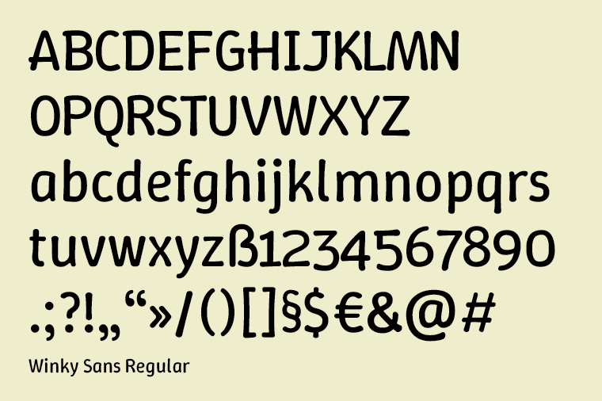
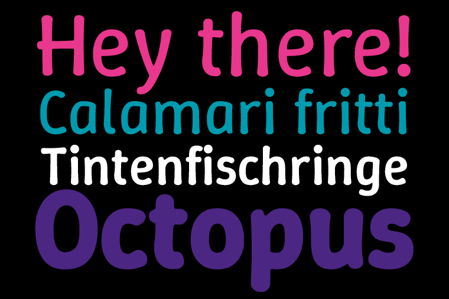

----

## Setting up your font

### New repositories

5. Fill out `documentation/DESCRIPTION.en_us.html` with a description about your font.

9. **Set up your GitHub pages site**: go to Settings > Pages and ensure that the "Source" drop-down is set to "Deploy from a Branch". Ensure that the "Branch" is set to `gh-pages`. If this branch is not available, check that the "Build font and specimen" action in the "Actions" tab has completed; if it completed successfully, then try again - `gh-pages` should now be an option.

10. If Github Actions has successfully built the family, you will find the font binaries in the Actions tab. The official Github Actions documentation provides further [information](https://docs.github.com/en/actions/managing-workflow-runs/downloading-workflow-artifacts).

----

# Winky Sans

[![][Fontbakery]](https://typofactur.github.io/winkysans/fontbakery/fontbakery-report.html)
[![][Universal]](https://typofactur.github.io/winkysans/fontbakery/fontbakery-report.html)
[![][GF Profile]](https://typofactur.github.io/winkysans/fontbakery/fontbakery-report.html)
[![][Shaping]](https://typofactur.github.io/winkysans/fontbakery/fontbakery-report.html)

[Fontbakery]: https://img.shields.io/endpoint?url=https%3A%2F%2Fraw.githubusercontent.com%2Ftypofactur%2Fwinkysans%2Fgh-pages%2Fbadges%2Foverall.json
[GF Profile]: https://img.shields.io/endpoint?url=https%3A%2F%2Fraw.githubusercontent.com%2Ftypofactur%2Fwinkysans%2Fgh-pages%2Fbadges%2FGoogleFonts.json
[Outline Correctness]: https://img.shields.io/endpoint?url=https%3A%2F%2Fraw.githubusercontent.com%2Ftypofactur%2Fwinkysans%2Fgh-pages%2Fbadges%2FOutlineCorrectnessChecks.json
[Shaping]: https://img.shields.io/endpoint?url=https%3A%2F%2Fraw.githubusercontent.com%2Ftypofactur%2Fwinkysans%2Fgh-pages%2Fbadges%2FShapingChecks.json
[Universal]: https://img.shields.io/endpoint?url=https%3A%2F%2Fraw.githubusercontent.com%2Ftypofactur%2Fwinkysans%2Fgh-pages%2Fbadges%2FUniversal.json

Description of your font goes here. We recommend to start with a very short presentation line (the kind you would use on twitter to present your project for example), and then add as much details as necesary :-) Origin of the project, idea of usage, concept of creation… but also number of masters, axes, character sets, etc.

Don't hesitate to create images!

## About

typofactur is a German foundry run by the graphic designer Simon Atzbach.

## Building

Fonts are built automatically by GitHub Actions - take a look in the "Actions" tab for the latest build.

If you want to build fonts manually on your own computer:

* `make build` will produce font files.
* `make test` will run [FontBakery](https://github.com/googlefonts/fontbakery)'s quality assurance tests.
* `make proof` will generate HTML proof files.

The proof files and QA tests are also available automatically via GitHub Actions - look at https://typofactur.github.io/winkysans.git.

## Changelog

When you update your font (new version or new release), please report all notable changes here, with a date.
[Font Versioning](https://github.com/googlefonts/gf-docs/tree/main/Spec#font-versioning) is based on semver. 
Changelog example:

**22 December 2024. Version 1.000**
- initial release

## License

This Font Software is licensed under the SIL Open Font License, Version 1.1.
This license is available with a FAQ at https://openfontlicense.org

## Repository Layout

This font repository structure is inspired by [Unified Font Repository v0.3](https://github.com/unified-font-repository/Unified-Font-Repository), modified for the Google Fonts workflow.
